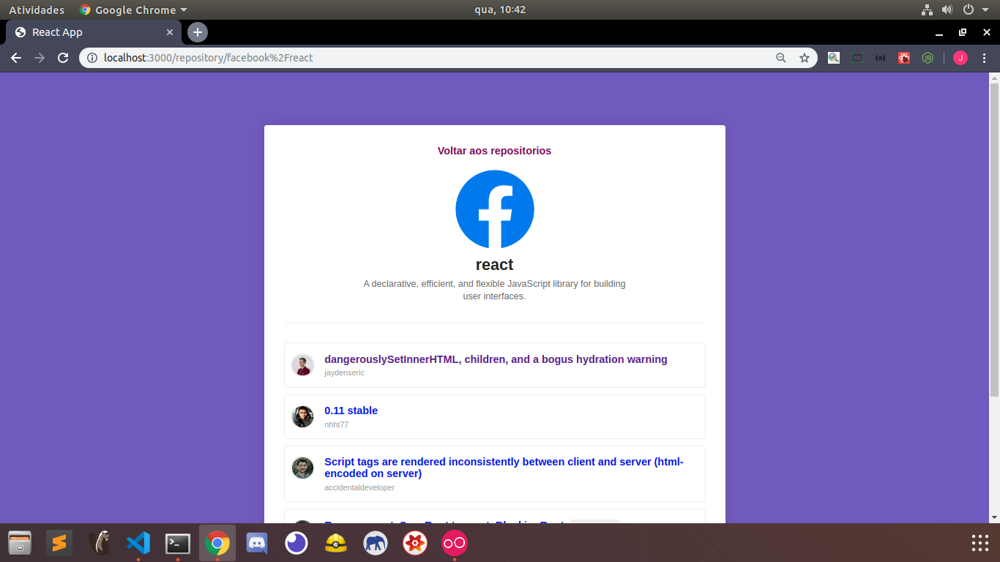
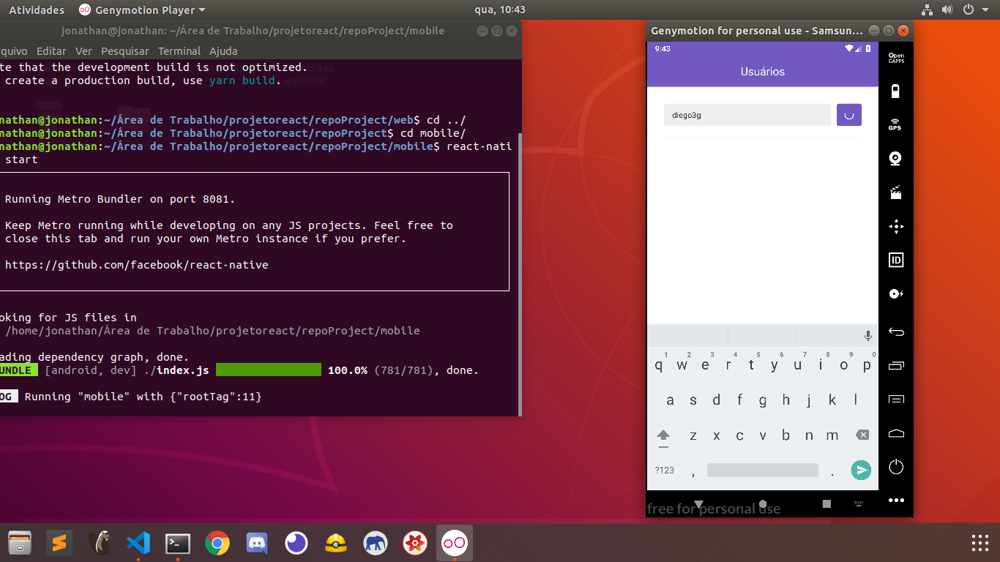
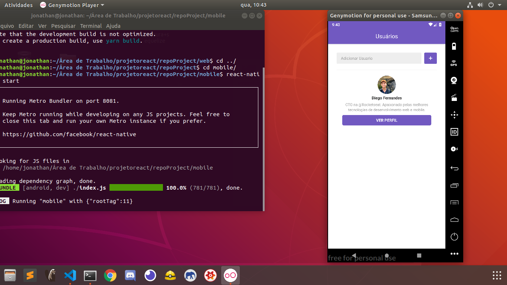
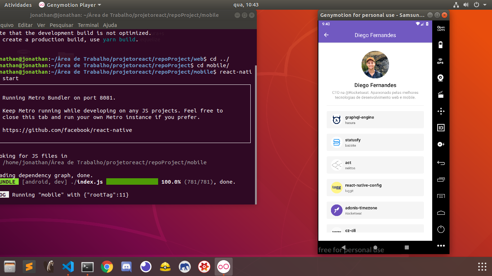

<h1> Mobile and Web project consuming gitHub's api</h1>
<h4>I did this project with ReactJs and ReactNative with learning proposal.</h4>
<h5>Things i've learned</h5>
<ul>
  <li>ReactComponents</li>
  <li>Consume an api with ReactJS asn Native using Axios</li>
  <li>Better structures for ReactJS and Native </li>
  <li>SPA (Single page application)</li>
  <li>Styled components</li>
  <li>React Navigation</li>
</ul>

<h2>WebView</h2>

  
  

<h2>MobileView</h2>

  
  
  

